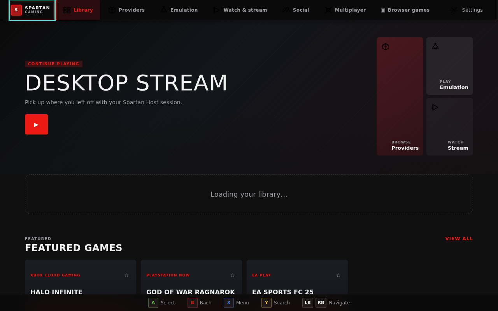
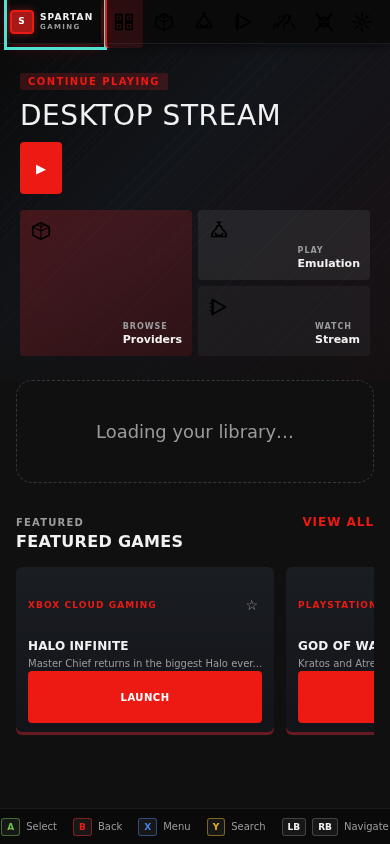
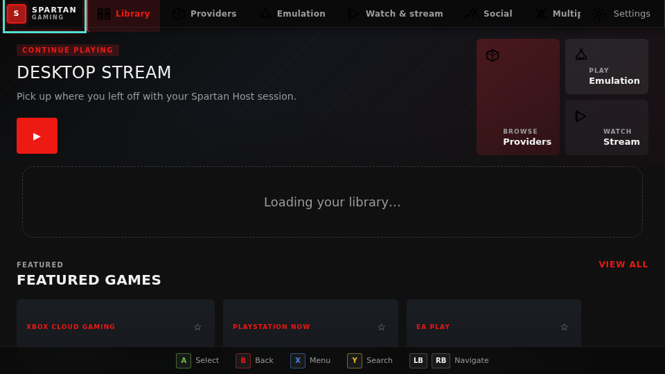
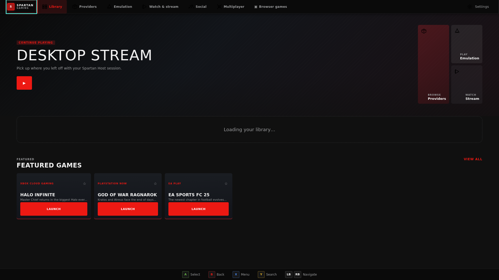

# Spartan Gaming Enhanced™

### One gaming command center. Every screen. Your games, your hardware, your rules.

Spartan Gaming Enhanced is an open-source, privacy-respecting gaming frontend designed to bring cloud gaming, remote play, browser games, emulation, local launches, controllers, capture, and diagnostics into one consistent experience.

Electron is the primary desktop application. The same bundled application UI and bounded platform bridges extend the project toward Windows, Linux, macOS, SteamOS and Steam Deck, ChromeOS, Android, Amazon Fire TV, and television-class devices. iOS is not a project target.

> **Built in the open, verified in layers.** Core interfaces and tested reference implementations are available today. Hardware-, driver-, signing-, store-certification-, and production-service gates stay explicitly open until they have real evidence. [See the full roadmap](ROADMAP.md).

  <svg width="120" style="filter: drop-shadow(0 0 8px var(--spartan-red));" viewBox="0 0 256 256" role="img" aria-labelledby="title desc">
    <title id="title">Spartan Gaming Enhanced</title>
    <desc id="desc">Spartan warrior helmet emblem</desc>
    <defs>
      <linearGradient id="grad1" x1="0%" y1="0%" x2="100%" y2="100%">
        <stop offset="0%" style="stop-color:#ed1913;stop-opacity:1" />
        <stop offset="50%" style="stop-color:#a61916;stop-opacity:1" />
        <stop offset="100%" style="stop-color:#5b0706;stop-opacity:1" />
      </linearGradient>
    </defs>
    <circle cx="128" cy="128" r="120" fill="#080b10" />
    <path d="M128 80 Q128 50 160 55 Q175 50 172 75 Q170 90 140 100 Q110 110 80 105 Q55 110 30 90 Q20 75 25 55 Q30 45 65 50 Q95 55 128 80 Z" fill="#ed1913" />
    <path d="M128 130 Q128 145 100 150 Q75 152 55 140 Q35 130 35 110 Q35 85 60 70 Q85 60 110 70 Q135 75 128 130 Z" fill="#aaa8a5" />
    <circle cx="100" cy="100" r="8" fill="#dedcd9" />
    <circle cx="156" cy="100" r="8" fill="#dedcd9" />
    <path d="M128 180 Q128 210 160 215 Q175 210 172 190 Q170 175 140 165 Q110 155 80 160 Q55 155 30 165 Q20 170 25 150 Q30 140 65 145 Q95 150 128 180 Z" fill="#5b0706" />
  </svg>

## Console-style experience

Spartan Gaming Enhanced keeps its Spartan colors, logos, typography, and visual identity
while using an Spartan console-inspired interaction model across the application:
hub-style navigation, controller and keyboard directional focus, clear selected
states, and horizontal content shelves that stay inside the viewport. Console
Mode turns the dashboard into a full-width gaming hub with the primary action,
resume session, library filters, and provider rails available from the first
screen.

Screenshots — Xbox One X console mode, 60 total (15 routes × 4 viewports), **console mode enabled by default**:

Console Mode is the permanent application state — the entire app transitions into a controller-focused hub with Spartan warrior aesthetic, compact navigation rails, and readiness-driven provider cards. The dashboard body defaults to `console-mode`, switching the navigation to horizontal rail layout, emphasizing Spartan red accents, and hiding resume controls unless a recoverable session exists.

| Desktop (1280×800)                                                                     | Mobile (390×844)                                                                       |
| -------------------------------------------------------------------------------------- | -------------------------------------------------------------------------------------- |
|  |  |

| Landscape (960×540)                                                                    | Television (1920×1080)                                                                 |
| -------------------------------------------------------------------------------------- | -------------------------------------------------------------------------------------- |
|  |  |